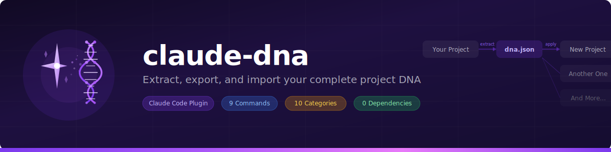
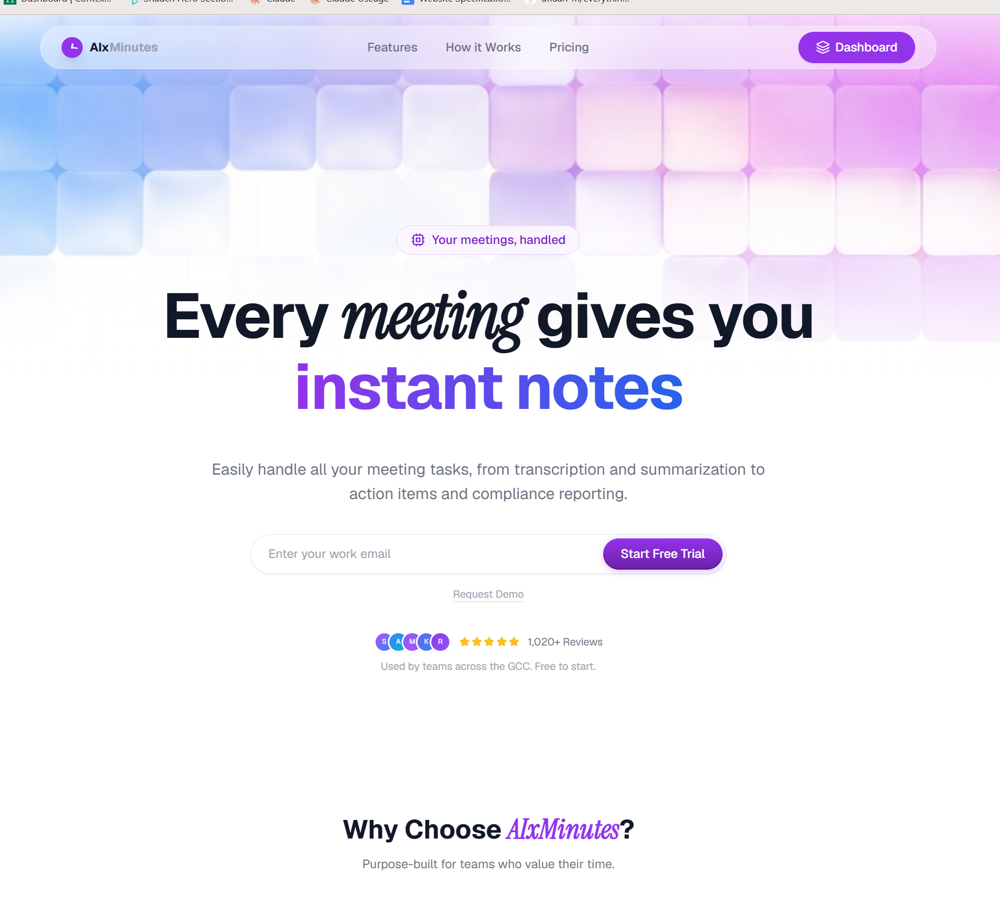
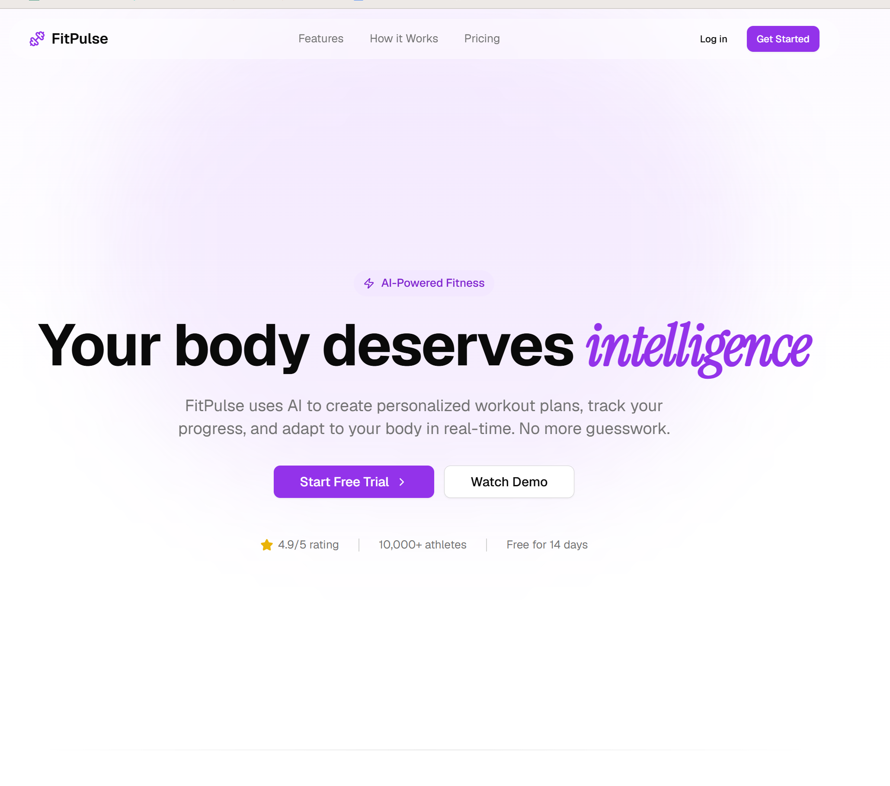
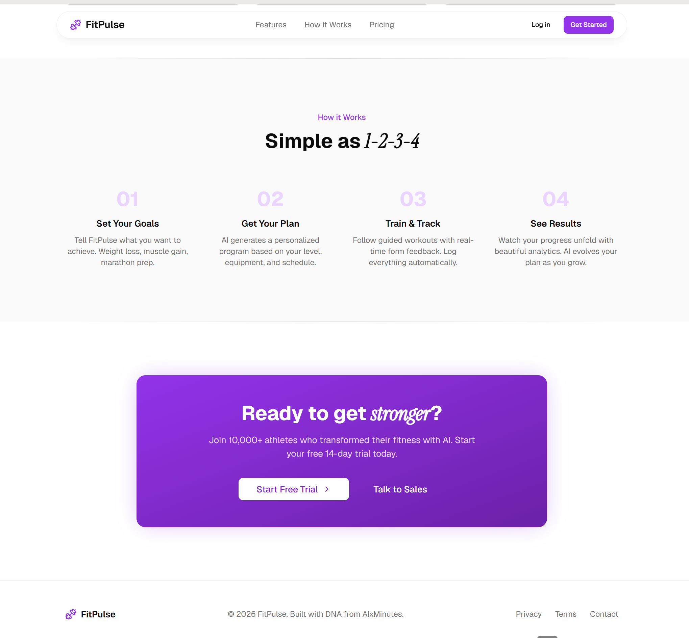

<p align="center">
  
</p>

<p align="center">
  <a href="https://opensource.org/licenses/MIT"></a>
  <a href="#-installation"></a>
  <a href="#-commands"></a>
  <a href="#-what-gets-captured"></a>
  <a href="https://github.com/mohammedsaifali/claude-dna/stargazers"></a>
  <a href="https://buymeacoffee.com/indiesaif"></a>
</p>

---

## The Problem

You've perfected your stack. Your design language is dialed in. Then you start a new project — and do it all over again.

<table>
<tr>
<td>

```diff
- Re-pick the same framework, same version
- Re-configure Tailwind with the same theme
- Re-set up the same CSS variables (light + dark)
- Re-install the same 30 packages
- Re-create the same button variants, nav, cards
- Re-configure the same linter, formatter, tests
```

</td>
<td>

```diff
+ One command to extract your DNA
+ One command to apply it anywhere
+ Your taste. Your stack. Your conventions.
+ Portable as a single JSON file
+ Evolves with you over time
+ Never start from scratch again
```

</td>
</tr>
</table>

## How It Works

```
  YOUR PROJECT                    DNA PRESET                    NEW PROJECT
 ┌──────────────┐              ┌──────────────┐              ┌──────────────┐
 │  Tech Stack  │   extract    │              │    apply     │  Same Stack  │
 │  Design      │ ──────────►  │   dna.json   │ ───────────► │  Same Design │
 │  Typography  │              │   ~4KB JSON  │              │  Same Fonts  │
 │  Components  │              │   Portable   │              │  Same Code   │
 │  Backend     │              │              │              │  Same YOU    │
 └──────────────┘              └──────────────┘              └──────────────┘
```

---

## 🎬 See It In Action

We extracted DNA from **AIxMinutes** (a production SaaS) and applied it to **FitPulse** (a fitness app). Different product, identical design language, zero manual CSS.

**Source — AIxMinutes:**

<p align="center">
  
</p>

**DNA Applied — FitPulse:**

<p align="center">
  
</p>
<p align="center">
  
</p>

> Same purple brand, same italic serif accents, same button styles, same section patterns. Footer reads: *"Built with DNA from AIxMinutes."*
>
> **`/claude-dna:extract` → `dna.json` → `/claude-dna:apply` → Done.**

---

## 📦 Installation

> **Prerequisites:** [Claude Code](https://claude.ai/code) v1.0.33 or later. No other dependencies.

### Option 1: Plugin Marketplace (Recommended)

Two steps — add the marketplace catalog, then install the plugin from it:

```bash
# Step 1: Add the marketplace (registers the catalog)
/plugin marketplace add mohammedsaifali/claude-dna

# Step 2: Install the plugin (registers the commands)
/plugin install claude-dna@claude-dna
```

After install, all `/claude-dna:*` commands are immediately available. Run `/claude-dna:status` to verify.

### Option 2: Local Development / Testing

Clone the repo and point Claude Code to it directly:

```bash
git clone https://github.com/mohammedsaifali/claude-dna.git ~/.claude/plugins/claude-dna
claude --plugin-dir ~/.claude/plugins/claude-dna
```

This loads the plugin for the current session. To test with multiple plugins:

```bash
claude --plugin-dir ~/.claude/plugins/claude-dna --plugin-dir ~/.claude/plugins/other-plugin
```

### Option 3: Copy Into Project

If you only want the skills and commands without the full plugin system:

```bash
git clone https://github.com/mohammedsaifali/claude-dna.git /tmp/claude-dna
cp -r /tmp/claude-dna/skills/project-dna your-project/.claude/skills/
cp -r /tmp/claude-dna/commands/* your-project/.claude/commands/
```

> **Note:** With this method, commands are available as `/extract`, `/apply`, etc. (without the `claude-dna:` prefix).

### Verify Installation

```
> /claude-dna:status

No Project DNA found in this directory.

Get started:
  /claude-dna:extract    Scan this project and capture its DNA
  /claude-dna:apply      Apply a preset from another project
  /claude-dna:list       See your saved presets
```

### Managing the Plugin

```bash
# Update to latest version
/plugin marketplace update claude-dna

# Temporarily disable
/plugin disable claude-dna@claude-dna

# Re-enable
/plugin enable claude-dna@claude-dna

# Uninstall
/plugin uninstall claude-dna@claude-dna

# Remove the marketplace catalog entirely
/plugin marketplace remove claude-dna

# Reload plugins without restarting Claude Code
/reload-plugins
```

---

## 🚀 Quick Start

<details open>
<summary><strong>1. Extract DNA from your best project</strong></summary>

```
> /claude-dna:extract

Scanning project...

✓ Tech Stack:    Next.js 15.1 (App Router) + TypeScript
✓ Design Tokens: 35 CSS variables (light + dark mode)
✓ Typography:    Geist Sans + Geist Mono + Instrument Serif
✓ Components:    shadcn/ui (new-york) — 8 button variants
✓ Architecture:  Feature-based, kebab-case, @/* aliases
✓ Backend:       Supabase + Inngest + Paddle
✓ Tooling:       ESLint + Vitest + Playwright

✓ Saved to .project-dna/dna.json
```
</details>

<details>
<summary><strong>2. Export to global preset library</strong></summary>

```
> /claude-dna:export
✓ Exported "my-saas-style" v1.0.0 to ~/.project-dna/presets/
```
</details>

<details>
<summary><strong>3. Apply to a new project</strong></summary>

```
> /claude-dna:apply my-saas-style

Apply: [Full DNA] [Design only] [Tech stack only] [Cherry-pick]
> Full DNA

✓ Scaffolded Next.js 15.1 with TypeScript
✓ Installed 30 dependencies
✓ Applied 35 CSS variables (light + dark)
✓ Configured shadcn/ui (new-york style)
✓ Created directory structure

Done! Your project has your DNA.
```
</details>

<details>
<summary><strong>4. Evolve your style over time</strong></summary>

```
> /claude-dna:evolve

  + Added color:   --warning (38 92% 50%)
  ↑ Upgraded:      framer-motion 11.0 → 12.1
  ~ Changed:       radius 0.5rem → 0.75rem

✓ DNA evolved: v1.0.0 → v1.1.0
```
</details>

---

## 🛠 Commands

| Command | Arguments | What It Does |
|:--------|:----------|:------------|
| **`/claude-dna:extract`** | — | Scan current project and capture its complete DNA |
| **`/claude-dna:apply`** | `[preset-name]` | Apply a preset — full, design-only, tech-only, or cherry-pick |
| **`/claude-dna:status`** | — | Display formatted DNA summary |
| **`/claude-dna:export`** | — | Save DNA to global presets (`~/.project-dna/presets/`) |
| **`/claude-dna:import`** | `<name \| path \| url>` | Import from named preset, file path, or URL |
| **`/claude-dna:list`** | — | List all saved presets |
| **`/claude-dna:audit`** | — | Detect drift between project and saved DNA |
| **`/claude-dna:diff`** | `<preset-a> [preset-b]` | Compare two presets side-by-side |
| **`/claude-dna:evolve`** | — | Accept project changes and bump preset version |

<details>
<summary><strong>Usage examples</strong></summary>

```bash
# Extract DNA from current project
/claude-dna:extract

# Apply a named preset to current project
/claude-dna:apply my-saas-style

# Import a preset from URL
/claude-dna:import https://example.com/presets/minimal.json

# Import from a local file
/claude-dna:import ../other-project/.project-dna/dna.json

# Compare two presets
/claude-dna:diff my-saas-style minimal-dashboard

# Compare a preset against current project DNA
/claude-dna:diff my-saas-style
```

</details>

---

## 🧩 What Gets Captured

> Not just colors. **Everything** that makes a project feel like *you* built it.

<table>
<tr>
<td width="50%" valign="top">

**🎨 Design & Frontend**

| | Category | Captures |
|:-:|:---------|:---------|
| 🎨 | **Design Tokens** | CSS variables, colors (light + dark), spacing, radius, shadows |
| 🔤 | **Typography** | Font families, sources, weights, line heights |
| ✨ | **Animations** | Framer Motion/GSAP, keyframes, easing, patterns |
| 🌊 | **Effects** | Glass morphism, gradients, glow, shimmer |
| 🧱 | **Components** | UI library, variants, cards, forms, modals, nav |

</td>
<td width="50%" valign="top">

**⚙️ Stack & Architecture**

| | Category | Captures |
|:-:|:---------|:---------|
| 📦 | **Tech Stack** | Framework, language, runtime, deployment |
| 📚 | **Dependencies** | All packages grouped by purpose |
| 🏗 | **Architecture** | File structure, naming, aliases, state mgmt |
| 🔧 | **Backend** | Database, auth, API, ORM, jobs, storage |
| 🧪 | **Tooling** | Linter, formatter, tests, CI/CD |
| 📏 | **Conventions** | Immutability, error handling, coding standards |

</td>
</tr>
</table>

---

## 📄 DNA File Format

Single portable JSON at `.project-dna/dna.json`. Human-readable, version-controlled.

<details>
<summary><strong>View example dna.json</strong></summary>

```json
{
  "name": "my-saas-style",
  "version": "1.0.0",
  "exported_from": "AIxMinutes",
  "tech_stack": {
    "framework": { "name": "next.js", "version": "15.1", "variant": "app-router" },
    "language": "typescript",
    "deployment": "vercel"
  },
  "design_tokens": {
    "colors": {
      "light": { "--background": "0 0% 100%", "--brand": "267 100% 67%" },
      "dark": { "--background": "220 20% 7%", "--brand": "280 100% 75%" }
    }
  },
  "typography": {
    "fonts": {
      "sans": { "family": "Geist Sans", "source": "package" },
      "accent": { "family": "Instrument Serif", "source": "google" }
    }
  },
  "component_patterns": { "ui_library": "shadcn-ui", "style": "new-york" },
  "backend": { "database": "supabase", "auth": "supabase-ssr", "jobs": "inngest" }
}
```
</details>

> Full schema: [dna-schema.md](skills/project-dna/references/dna-schema.md)

---

## 📊 Comparison

| Feature | Claude DNA | Boilerplates | Figma Tokens | interface-design |
|:--------|:----------:|:------------:|:------------:|:----------------:|
| Extracts from YOUR project | ✅ | ❌ | ❌ | ⚠️ |
| Captures full tech stack | ✅ | ⚠️ | ❌ | ❌ |
| Captures design tokens | ✅ | ⚠️ | ✅ | ✅ |
| Captures backend + architecture | ✅ | ⚠️ | ❌ | ❌ |
| Export / import presets | ✅ | Git clone | Sync | File |
| Evolve over time | ✅ | ❌ | ❌ | ❌ |
| Drift detection | ✅ | ❌ | ❌ | ✅ |
| Cherry-pick application | ✅ | ❌ | ⚠️ | ❌ |

---

## 🌍 Supported Ecosystems

| Ecosystem | Detected From |
|:----------|:-------------|
| **Next.js / React** | `package.json`, `next.config.*`, `tailwind.config.*`, `components.json` |
| **Vue / Nuxt** | `package.json`, `nuxt.config.*`, `tailwind.config.*` |
| **Svelte / SvelteKit** | `package.json`, `svelte.config.*`, `tailwind.config.*` |
| **Python / Django / Flask** | `requirements.txt`, `pyproject.toml`, `settings.py` |
| **Go** | `go.mod`, project structure |
| **Rust** | `Cargo.toml`, project structure |
| **Flutter / Dart** | `pubspec.yaml`, theme files |
| **Swift / SwiftUI** | `Package.swift`, asset catalogs |

---

## 📂 Structure

```
claude-dna/
├── .claude-plugin/
│   ├── plugin.json              # Plugin manifest
│   └── marketplace.json         # Distribution config
├── commands/                    # 9 slash commands
│   ├── extract.md    apply.md    status.md
│   ├── export.md     import.md   list.md
│   └── audit.md      diff.md     evolve.md
├── skills/
│   └── project-dna/
│       ├── SKILL.md             # Core brain
│       └── references/
│           └── dna-schema.md    # Full JSON schema
├── assets/                      # Banner + screenshots
├── README.md
└── LICENSE                      # MIT
```

---

## 🔧 Troubleshooting

<details>
<summary><strong>"Marketplace added but commands not found"</strong></summary>

The marketplace is just the catalog. You need to install the plugin from it:

```bash
/plugin install claude-dna@claude-dna
```

The first `claude-dna` is the plugin name, the second is the marketplace name.

</details>

<details>
<summary><strong>"Invalid schema" error when adding marketplace</strong></summary>

Make sure you're on the latest version. The marketplace format requires a top-level `name` and `owner` field. Update to the latest:

```bash
/plugin marketplace update claude-dna
```

Or remove and re-add:

```bash
/plugin marketplace remove claude-dna
/plugin marketplace add mohammedsaifali/claude-dna
/plugin install claude-dna@claude-dna
```

</details>

<details>
<summary><strong>Commands not appearing after install</strong></summary>

Try reloading plugins:

```bash
/reload-plugins
```

If that doesn't work, verify the plugin is installed and enabled:

```bash
/plugin marketplace list
```

</details>

<details>
<summary><strong>"No Project DNA found" when running commands</strong></summary>

Most commands require a `.project-dna/dna.json` file in your project. Run `/claude-dna:extract` first to create one, or `/claude-dna:import` to bring in an existing preset.

</details>

---

## 🤝 Contributing

```bash
# Clone and test locally
git clone https://github.com/mohammedsaifali/claude-dna.git
cd claude-dna

# Test your changes in Claude Code
claude --plugin-dir .

# Validate plugin structure
claude plugin validate .

# Submit a PR
git checkout -b feat/my-feature
git commit -m 'feat: add my feature'
git push origin feat/my-feature
```

**Ideas:** Community preset gallery · Visual diff viewer · Framework-specific templates · DNA merge tool · VS Code extension

---

## 🙏 Acknowledgments

- Inspired by [interface-design](https://github.com/Dammyjay93/interface-design) by Damola Akinleye
- Built on the [Claude Code Plugin System](https://code.claude.com/docs/en/plugins) by Anthropic

---

<p align="center">
  <a href="https://buymeacoffee.com/indiesaif"></a>
</p>

<p align="center">
  <strong>Build once. Apply everywhere.</strong><br/>
  <sub>Made by <a href="https://github.com/mohammedsaifali">Saif</a> · Powered by Claude Code</sub>
</p>
